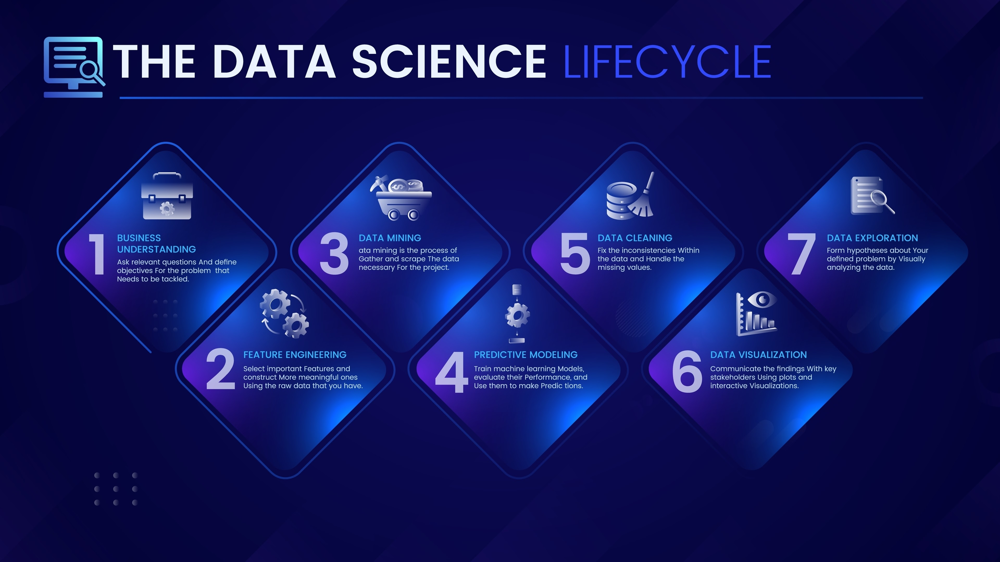

# DS502
DS502 Project
Ömer Faruk Kurt 

# 📊 Project Development Pipeline

This repository contains the end-to-end workflow for the project, spanning from initial data acquisition to final stakeholder delivery.

---

## 🚀 Project Milestones

### 1. Data Ingestion & Preparation
* **Data Collection:** Gathering and centralizing all necessary raw data sources.
* **Preprocessing:** Cleaning and structuring data for optimal model performance.

### 2. Research & Modeling
* **Model Development:** Engineering and training the core model architecture.
* **Result Reporting:** Analyzing performance metrics and documenting outcomes.

### 3. Visualization & Tooling
* **Custom Plotting:** Developing specialized functions for data exploration and result interpretation.
* **Insight Generation:** Transforming raw numbers into visual narratives.

### 4. Final Delivery
* **Progressive QA:** Continuous code quality checks and refactoring throughout the lifecycle.
* **Stakeholder Materials:** Preparation of the final comprehensive report and presentation deck.

---

## 🛠 Progress Tracker

| Phase | Task | Status |
| :--- | :--- | :--- |
| **01** | Data Collection | ⬜ In Progress |
| **02** | Model Creation | ⬜ Pending |
| **03** | Result Reporting | ⬜ Pending |
| **04** | Plotting Functions | ⬜ Pending |
| **05** | Final Report & Presentation | ⬜ Pending |

> **Pro Tip:** Code quality is monitored progressively. Ensure all contributions pass linting before merging to the main branch.
